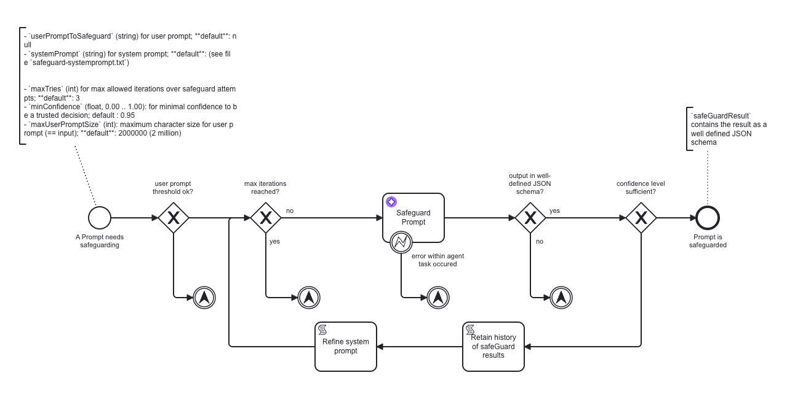

# AI Firewall Agent

This repository contains a Camunda building block that evaluates an incoming user prompt before it reaches an AI-powered task. It helps you detect unsafe prompts and return a structured decision your process can act on.



## What problem this building block solves
User prompts can contain malicious or unsafe instructions. In an AI-powered workflow, that can lead to prompt injection, manipulated agent behavior, or unsafe downstream actions.

## Where to use this building block
Use the AI Firewall Agent when:
- User input is passed to an AI task
- External users interact with an AI-powered workflow
- AI-generated decisions trigger automated actions
- Sensitive systems are connected downstream

A common pattern is to place this building block directly before the AI task or call activity that uses the prompt.

## How it works
- Your process passes a user prompt into the safeguard-agent process.
- The firewall evaluates the prompt with your configured AI provider and model.
- If the result is valid but confidence is below `minConfidence`, the process stores the previous result, refines the system prompt, and retries until `maxTries` is reached.
- The process returns `safeGuardResult`, which your workflow can use to continue, warn, block, escalate, or sanitize the prompt before reuse.

## Repository contents
The `camunda-artifacts` directory contains the main BPMN and reference files for the building block:

| File | Purpose |
|------|---------|
| `safeguard-agent.bpmn` | **Required.** Main firewall process to deploy to your Camunda cluster. |
| `safeguard-agent-usage-example.bpmn` | Example BPMN that calls the safeguard agent via a Call Activity. See [example](camunda-artifacts/README-usage-example.md) (Optional)  |
| `safeguard-systemprompt.txt` | Reference system prompt used by the firewall. |
| `safeguard-systemprompt-feel.txt` | FEEL-escaped version of the system prompt for BPMN expressions. |
| `safeguard-confidence-refinement.txt` | Directive appended when confidence is too low and the process retries. |

## Prerequisites

- **Camunda 8.8+** - e.g. [c8run](https://docs.camunda.io/docs/self-managed/setup/deploy/local/c8run/) for local development, or a [SaaS](https://docs.camunda.io/docs/guides/create-cluster/) / Self-Managed cluster

## Quick Start

Deploy and configure the building block

- Customize `safeguard-agent.bpmn` and deploy to your Camunda 8.8+ cluster.
- Select the `Safeguard Prompt` task and configure:
  - **Model provider** — the AI provider to use (e.g. OpenAI, Azure OpenAI, Ollama, etc.)
  - **Model** — the specific model name (e.g. `gpt-4o`, `llama3`, etc.)
  - **API key / Credentials** — as required by the chosen provider (typically via Connector secrets)

Start a process instance
For the minimal happy path, start the process with a prompt like this:

```json
{
  "userPromptToSafeguard": "What is the status of my insurance claim number IC-2024-001?"
}
```

## Inputs and configuration

### Required

| Variable | Description | Default |
|----------|-------------|---------|
| `userPromptToSafeguard`| (string) the user prompt to evaluate | null |
| `systemPrompt`| (string) for system prompt | (see file `safeguard-systemprompt.txt`) |

### Optional Guardrails

The guardrails for the AI Firewall Agent are set via these process variables.  
You can supply them to the Process Instance or set them directly in `safeguard-agent.bpmn`:

| Variable | Description | Default |
|----------|-------------|---------|
| `systemPrompt` | Embedded pre-configured prompt | Override the firewall instructions used for analysis |
| `maxTries`| `3` | Maximum safeguard attempts before escalation |
| `minConfidence` | `0.95` | Minimum confidence required to trust the decision |
| `maxUserPromptSize` | `2000000` | Maximum allowed prompt size in characters |

### Confidence refinement loop

When the LLM returns a valid safeguard result but the confidence score falls below `minConfidence`, the process automatically:

1. **Retains the result history** – the current `safeGuardResult` is appended to `safeGuardResultHistory` for auditability.
2. **Refines the system prompt** – a `CONFIDENCE REFINEMENT DIRECTIVE` is appended to the system prompt, instructing the LLM to re-examine its assessment with deeper analysis and the previous result as context (see `safeguard-confidence-refinement.txt` for the template).
3. **Loops back** to the iteration check – if `_current_try` ≤ `_maxTries`, the refined prompt is sent again; otherwise the `safeguard_max-iterations-reached` escalation fires.

## Output

The process writes its result to the `safeGuardResult` variable using this schema:

```json
{
  "decision": "allow | warn | block",
  "risk_labels": [
    "injection | jailbreak | harmful_intent | policy_evasion | sensitive_data | privacy | obfuscation | tool_manipulation | other"
  ],
  "reasons": [
    "Short, concrete bullets explaining the key risks or the absence of them."
  ],
  "evidence": [
    "Exact quoted spans from the user prompt that support each reason."
  ],
  "sanitized_prompt": "If decision is warn or block, provide a single revised version of the user prompt with unsafe directives removed or neutralized while preserving legitimate intent. For clearly safe 'allow' cases where a rewrite is unnecessary, return an empty string.",
  "normalizations_applied": [
    "List of normalization steps performed (e.g., removed zero-width chars, decoded URL-encoding)."
  ],
  "confidence": 0.0
}
```

### What the decision means

`allow` — The prompt is safe to continue as-is.
`warn` — The prompt has issues, but you may continue with additional review or a sanitized version.
`block` — The prompt should not continue downstream.


### Error handling and escalations

The building block can escalate when the prompt is too large, the model output is invalid, retries are exhausted, or the AI task fails.

Common escalation paths include:

`safeguard_max-user-input-exceeded`
`safeguard_max-iterations-reached`
`safeguard_task-agent-failed`
`safeguard_json-worker-error`
`safeguard_bad-agent-output`

The usage example catches these escalations and converts them into BPMN errors so operators can review failures

## Development setup

### Enable pre-commit formatting hook

```bash
git config core.hooksPath .githooks
```

This activates a pre-commit hook that runs `mvn spotless:apply` automatically before each commit.

## Running tests

### Requirements

- **Java 25** (JDK) — only for building and running tests locally
- **Maven 3.9+** — only for building and running tests locally
- **Docker** — required for running tests (Testcontainers)

### Unit / CPT tests

```bash
mvn test
```

Tests use [Camunda Process Test](https://docs.camunda.io/docs/apis-tools/testing/getting-started/) with Testcontainers and WireMock and require Docker

The build enforces:
- **60 %** BPMN path coverage (via `camunda-process-test`)
- **80 %** line coverage (via JaCoCo)

### Prompt Tests

Tests that validate prompt classification with real LLM calls.

`SafeguardPromptClassificationIT` sends actual user prompts through the safeguard-agent BPMN process using GitHub Models (openai/gpt-4.1-mini) via the Camunda Process Test connectors runtime.
Tests are auto-discovered from prompt files — grouped by expected decision (`block`, `warn`, `allow`).

| Aspect | Detail |
|--------|--------|
| **Naming convention** | `*IT.java` suffix → Maven Failsafe plugin |
| **Base class** | `LlmIntegrationTestBase` |
| **LLM provider** | [GitHub Models](https://models.github.ai/inference) — `openai/gpt-4.1-mini` |
| **Auth** | `GITHUB_TOKEN` env var (in CI: `permissions: models: read`) |
| **Speed** | 10-30 s per prompt (real HTTP calls) |

#### Running locally

```bash
export GITHUB_TOKEN=ghp_...
mvn failsafe:integration-test -B
```

If `GITHUB_TOKEN` is not set, tests are automatically skipped.

#### Adding new test cases

Drop a text file into `src/test/resources/prompts/` following the naming convention:

```shell
safeguard-<category>-<name>.txt
```

where `<category>` is one of `block`, `warn`, or `allow`.

Examples:

- `safeguard-block-sqli.txt` — prompt that should be **blocked**
- `safeguard-warn-suspicious.txt` — prompt that should trigger a **warning**
- `safeguard-allow-greeting.txt` — safe prompt that should be **allowed**

No code changes required — the test factory discovers new files automatically.

#### minConfidence setting

LLM integration tests set `minConfidence: 0.5` (lower than production default of 0.95) to avoid retry loops during testing. Assertions target the `decision` value, not confidence.

#### Coverage

Integration test coverage is tracked separately in `jacoco-it.exec`, then merged with unit test coverage in `jacoco-merged.exec`. This is already configured in `pom.xml`.
